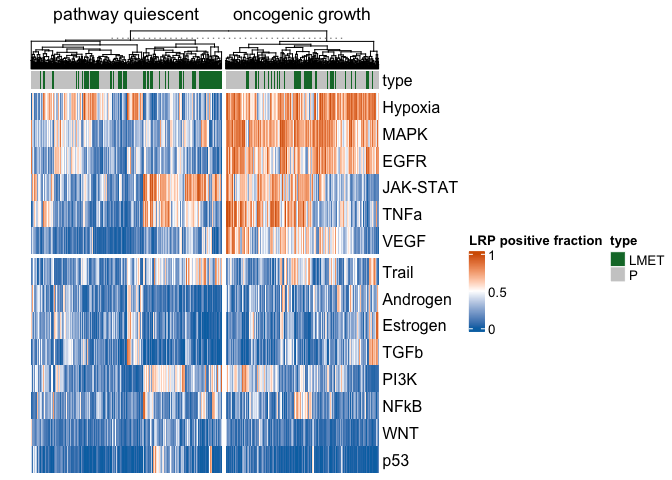
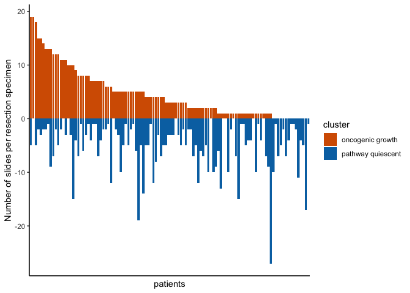
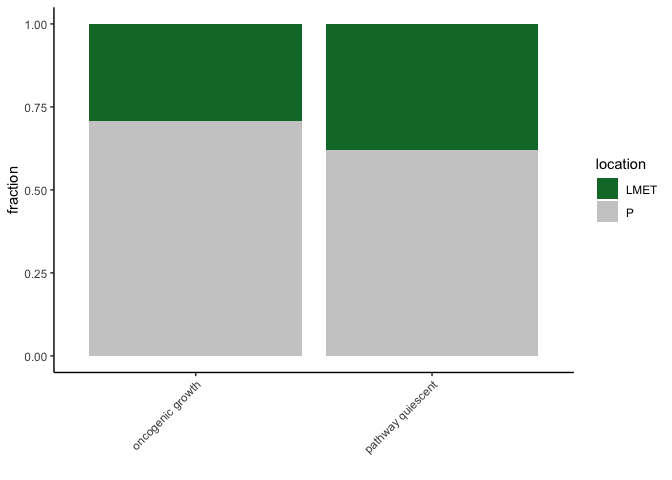
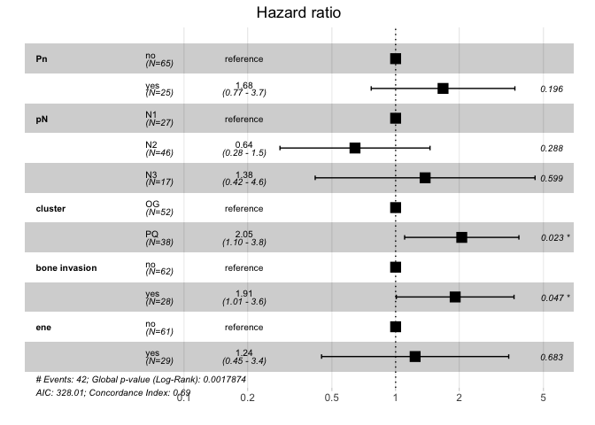
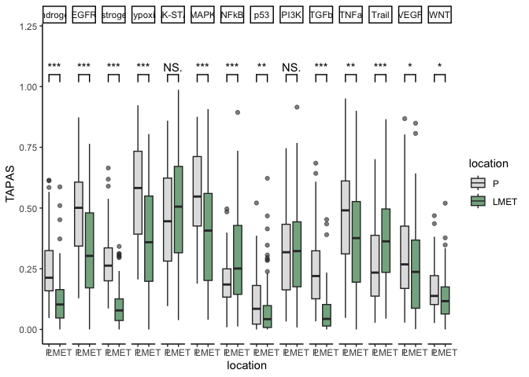

# Load packages

    suppressPackageStartupMessages({
    library(readxl)
    library(tidyverse)
    library(ComplexHeatmap)
    library(circlize)
    library(survival)
    library(survminer)
    library(dplyr)
    library(purrr)
    library(broom)
    library(survival)
    library(forcats)
    library(rlang)
    library(ggforestplot)
    library(paletteer)
    library(gtsummary)
    library(kableExtra)
    library(ggsignif)
    library(xtable)
    })

# Load data

‘pred’ = dataframe summarizing the LRP positive fractions per slide and
per pathway ‘clin’ = clinical metadata

    pred <- read_tsv("lmu_predictions.tsv")

    ## Rows: 14924 Columns: 9
    ## ── Column specification ────────────────────────────────────────────────────────
    ## Delimiter: "\t"
    ## chr (4): case_id, slide_id, pathway, location
    ## dbl (5): resection_site_id, num_tumor_patches, lrp_pos_fraction, patienten-i...
    ## 
    ## ℹ Use `spec()` to retrieve the full column specification for this data.
    ## ℹ Specify the column types or set `show_col_types = FALSE` to quiet this message.

    clin <- read_tsv("lmu_clinical_data.tsv")

    ## Rows: 112 Columns: 18
    ## ── Column specification ────────────────────────────────────────────────────────
    ## Delimiter: "\t"
    ## chr (12): case_id, sex (male), radio(-chemotherapy) (yes), location, pT, pN,...
    ## dbl  (6): index, age, disease recurrence, time from op to recurrence or last...
    ## 
    ## ℹ Use `spec()` to retrieve the full column specification for this data.
    ## ℹ Specify the column types or set `show_col_types = FALSE` to quiet this message.

# Supplemental Table 1 - Clinicopathological parameters of LMU cohort - categorial parameters

Helper function to generate Latex table

    clin_to_latex <- function(df,
                              exclude = NULL,
                              caption = "Suppl. Table 1 - Clinicopathologic characteristics of categorial parameters in the LMU cohort (n=112 patients). ",
                              label   = "tab:clinicopath_cat",
                              percent_digits = 1) {

      # select relevant columns
      df_sel <- df %>% select(-all_of(exclude))

      # reshape and count
      counts <- df_sel %>%
        pivot_longer(everything(), names_to = "Variable", values_to = "Value") %>%
        mutate(Value = ifelse(is.na(Value) | Value == "", "NA", as.character(Value))) %>%
        count(Variable, Value, name = "Count")

      # compute per-variable totals and percentages
      counts <- counts %>%
        group_by(Variable) %>%
        mutate(Total = sum(Count),
               Percent = 100 * Count / Total,
               Percent_fmt = sprintf(paste0("%.", percent_digits, "f\\\\%%"), Percent)) %>%
        ungroup() %>%
        arrange(Variable, Value)

      # build LaTeX rows: show Variable only on first row of its block
      latex_rows <- counts %>%
        group_by(Variable) %>%
        mutate(Variable_print = if_else(row_number() == 1, Variable, "")) %>%
        ungroup() %>%
        transmute(row = sprintf("  %s & %s & %3d & %s \\\\",
                                Variable_print, Value, Count, Percent_fmt)) %>%
        pull(row)

      # assemble LaTeX table
      latex_table <- c(
        "\\begin{table}[ht]",
        "\\centering",
        sprintf("\\caption{%s}", caption),
        sprintf("\\label{%s}", label),
        "\\begin{tabular}{l l r r}",
        "\\hline",
        "Variable & Level & Count & Percent \\\\",
        "\\hline",
        latex_rows,
        "\\hline",
        "\\end{tabular}",
        "\\end{table}"
      )

      cat(paste(latex_table, collapse = "\n"))
    }

    clin_to_latex(clin, exclude = c(1,2,3,15,16,17,18))

    ## \begin{table}[ht]
    ## \centering
    ## \caption{Suppl. Table 1 - Clinicopathologic characteristics of categorial parameters in the LMU cohort (n=112 patients). }
    ## \label{tab:clinicopath_cat}
    ## \begin{tabular}{l l r r}
    ## \hline
    ## Variable & Level & Count & Percent \\
    ## \hline
    ##   L & NA &   2 & 1.8\\% \\
    ##    & no &  67 & 59.8\\% \\
    ##    & yes &  43 & 38.4\\% \\
    ##   Pn & NA &   1 & 0.9\\% \\
    ##    & no &  81 & 72.3\\% \\
    ##    & yes &  30 & 26.8\\% \\
    ##   V & NA &   2 & 1.8\\% \\
    ##    & no & 102 & 91.1\\% \\
    ##    & yes &   8 & 7.1\\% \\
    ##   bone invasion & NA &   1 & 0.9\\% \\
    ##    & no &  77 & 68.8\\% \\
    ##    & yes &  34 & 30.4\\% \\
    ##   ene & NA &   2 & 1.8\\% \\
    ##    & no &  73 & 65.2\\% \\
    ##    & yes &  37 & 33.0\\% \\
    ##   grading & G1 &   6 & 5.4\\% \\
    ##    & G2 &  74 & 66.1\\% \\
    ##    & G3 &  31 & 27.7\\% \\
    ##    & NA &   1 & 0.9\\% \\
    ##   location & Buccal mucose &   9 & 8.0\\% \\
    ##    & Floor of mouth &  30 & 26.8\\% \\
    ##    & Lip &   2 & 1.8\\% \\
    ##    & Mandible &  23 & 20.5\\% \\
    ##    & Maxilla / soft palate &   9 & 8.0\\% \\
    ##    & Retromolar / intramaxillary &   8 & 7.1\\% \\
    ##    & Tongue &  31 & 27.7\\% \\
    ##   pN & N1 &  36 & 32.1\\% \\
    ##    & N2 &  57 & 50.9\\% \\
    ##    & N3 &  19 & 17.0\\% \\
    ##   pT & T1 &  16 & 14.3\\% \\
    ##    & T2 &  34 & 30.4\\% \\
    ##    & T3 &  27 & 24.1\\% \\
    ##    & T4 &  35 & 31.2\\% \\
    ##   radio(-chemotherapy) (yes) & NA &   6 & 5.4\\% \\
    ##    & no &  23 & 20.5\\% \\
    ##    & yes &  83 & 74.1\\% \\
    ##   sex (male) & no &  46 & 41.1\\% \\
    ##    & yes &  66 & 58.9\\% \\
    ## \hline
    ## \end{tabular}
    ## \end{table}

# Suppl. Table 2 - Clinicopathological parameters of LMU cohort - continous parameters

Helper function

    clin_continuous_to_latex <- function(df,
                                         cols,
                                         caption = "Continuous variables (median and range)",
                                         label   = "tab:continuous",
                                         digits  = 1,
                                         longtable = FALSE) {

      # Subset to requested columns; keep original names
      df_sel <- df[, cols, drop = FALSE]

      # Compute summary per variable
      summ <- imap_dfr(df_sel, function(x, nm) {
        # coerce to numeric if needed
        x_num <- suppressWarnings(as.numeric(x))
        n_miss <- sum(is.na(x_num))
        n_non  <- sum(!is.na(x_num))
        med    <- if (n_non > 0) median(x_num, na.rm = TRUE) else NA_real_
        q1     <- if (n_non > 0) quantile(x_num, 0.25, na.rm = TRUE, names = FALSE) else NA_real_
        q3     <- if (n_non > 0) quantile(x_num, 0.75, na.rm = TRUE, names = FALSE) else NA_real_
        mn     <- if (n_non > 0) min(x_num, na.rm = TRUE) else NA_real_
        mx     <- if (n_non > 0) max(x_num, na.rm = TRUE) else NA_real_
        tibble(
          Variable = nm,
          N        = n_non,
          Missing  = n_miss,
          Median   = med,
          Min      = mn,
          Max      = mx,
          IQR_low  = q1,
          IQR_high = q3
        )
      }) %>%
        mutate(
          Median_fmt = ifelse(is.na(Median), "NA", sprintf(paste0("%.", digits, "f"), Median)),
          Range_fmt  = ifelse(is.na(Min) | is.na(Max), "NA",
                              paste0(sprintf(paste0("%.", digits, "f"), Min),
                                     "--",
                                     sprintf(paste0("%.", digits, "f"), Max))),
          IQR_fmt    = ifelse(is.na(IQR_low) | is.na(IQR_high), "NA",
                              paste0(sprintf(paste0("%.", digits, "f"), IQR_low),
                                     "--",
                                     sprintf(paste0("%.", digits, "f"), IQR_high)))
        )

      # Final display table: one row per variable
      out <- summ %>%
        transmute(
          Variable,
          N,
          Missing,
          `Median (min--max)` = paste0(Median_fmt, " (", Range_fmt, ")"),
          `IQR (Q1--Q3)`      = IQR_fmt
        )

      # Build LaTeX manually (consistent with your previous table style)
      header <- c(
        if (!longtable) "\\begin{table}[ht]" else "",
        "\\centering",
        sprintf("\\caption{%s}", caption),
        sprintf("\\label{%s}", label),
        if (!longtable) "\\begin{tabular}{l r r l l}" else "\\begin{longtable}{l r r l l}",
        "\\hline",
        "Variable & N & Missing & Median (min--max) & IQR (Q1--Q3) \\\\",
        "\\hline"
      )
      rows <- apply(out, 1, function(r)
        sprintf("%s & %s & %s & %s & %s \\\\",
                r[[1]], r[[2]], r[[3]], r[[4]], r[[5]]))
      footer <- c(
        "\\hline",
        if (!longtable) "\\end{tabular}" else "\\end{longtable}",
        if (!longtable) "\\end{table}" else ""
      )

      cat(paste(c(header, rows, footer), collapse = "\n"))
    }

    clin_continuous_to_latex(
      clin,
      cols    = c(3, 16, 17, 18),
      caption = "Suppl. Table 2 - Clinicopathologic characteristics of continous parameters in the LMU cohort (n=112 patients).",
      label   = "tab:continuous",
      digits  = 1
    )

    ## \begin{table}[ht]
    ## \centering
    ## \caption{Suppl. Table 2 - Clinicopathologic characteristics of continous parameters in the LMU cohort (n=112 patients).}
    ## \label{tab:continuous}
    ## \begin{tabular}{l r r l l}
    ## \hline
    ## Variable & N & Missing & Median (min--max) & IQR (Q1--Q3) \\
    ## \hline
    ## age & 112 &  0 & 67.5 (30.0--93.0) & 59.8--75.2 \\
    ## time from op to recurrence or last follow up(days) &  92 & 20 & 454.0 (11.0--4001.0) & 199.8--1201.0 \\
    ## nLMET_slides & 112 &  0 & 2.0 (0.0--20.0) & 1.0--4.0 \\
    ## nP_slides & 112 &  0 & 6.0 (0.0--20.0) & 3.0--9.0 \\
    ## \hline
    ## \end{tabular}
    ## \end{table}

# Figure 3a - Heatmap and clustering of inferred pathway activities in LMU test cohort (112 patients, 1066 slides)

Create matrix ‘mat’ from preds dataframe for heatmap visualization and
exclude slides with less than 100 tumor patches to ensure that the
predictive LRP-positive fractions are representative for the slide.

    df_for_mat <- pred %>%
      filter(num_tumor_patches>100) %>%
      select(slide_id, pathway, lrp_pos_fraction, case_id, location) %>%
      spread(key="pathway", value="lrp_pos_fraction") 
    mat <- apply(as.matrix(df_for_mat[,-c(1:3)]),2,as.numeric)
    rownames(mat) <- df_for_mat$slide_id

    column_annotation <- HeatmapAnnotation(
      type=df_for_mat$location,
      col = list(
        type=c("P"="grey80","LMET"="#117733")
      )
    )

    ht <- Heatmap(t(mat), 
            show_column_names = FALSE,
            column_km = 2,
            row_km=2,
            name="LRP positive fraction",
           column_title = c("pathway quiescent","oncogenic growth"),
            row_title=c("",""), show_row_dend = FALSE,
            col = colorRamp2(c(0, 0.5, 1), c("#0072B2", "white", "#D55E00")),
            top_annotation = column_annotation)

    set.seed(1)

    #png("plots/figure3a.png", width = 7, height = 3, units = "in", res=600)
    ht_drawn <- draw(ht)

    #dev.off()

# Figure 3b - Waterfall plot of number of slides per resection specimen

    # extract clustering assignments and summarize on patient level
    column_order_list <- ComplexHeatmap:::column_order(ht_drawn) 
    cluster1_slides <- rownames(mat)[column_order_list$`1`]
    pred$cluster <- ifelse(pred$slide_id %in% cluster1_slides, "pathway quiescent", "oncogenic growth")
    patient_clusters = table(pred$`patienten-id`, pred$cluster) / 14

    # assign patients to cluster group by most abundant cluster
    clin$cluster <- if_else(patient_clusters[,1]>patient_clusters[,2], "pathway quiescent", "oncogenic growth")

    # create dataframe for waterfall plot
    patients_cluster_df <- as_tibble(as.data.frame(patient_clusters))
    patients_cluster_df$Freq[patients_cluster_df$Var2=="pathway quiescent"] <- patients_cluster_df$Freq[patients_cluster_df$Var2=="pathway quiescent"] * (-1)
    colnames(patients_cluster_df) <- c("patient","cluster","Freq")

    # Plot
    og_order <- patients_cluster_df %>%
      mutate(Freq = as.numeric(Freq)) %>%
      filter(cluster == "oncogenic growth", Freq > 0) %>%
      group_by(patient) %>%
      summarise(og = max(Freq), .groups = "drop") %>%
      arrange(desc(og)) %>%
      pull(patient)

    patients_cluster_df %>%
      mutate(patient = factor(patient, levels = c(og_order, setdiff(unique(patient), og_order)))) %>%
      ggplot(aes(x = patient, y = Freq, fill = cluster)) +
      geom_col(position = "identity") +
      scale_fill_manual(values = c("pathway quiescent" = "#0072B2",
                                   "oncogenic growth" = "#D55E00")) +
      labs(x = "patients", y = "Number of slides per resection specimen") +
      theme_classic() +
      theme(axis.text.x = element_blank(),
            axis.ticks.x = element_blank()) 

    #ggsave("plots/figure3b.png", height = 3, width = 5, dpi=600)

# Figure 3c - Clusters ~ P vs LMET

    # extract clustering assignments and summarize on patient level
    column_order_list <- ComplexHeatmap:::column_order(ht_drawn) 
    cluster1_slides <- rownames(mat)[column_order_list$`1`]
    pred$cluster <- ifelse(pred$slide_id %in% cluster1_slides, "pathway quiescent", "oncogenic growth")

    pred %>%
      select(slide_id, location, cluster) %>%
      distinct() %>%
      ggplot(aes(x=cluster)) +
      geom_bar(aes(fill=location), position="fill") +
      theme_classic() +
      scale_fill_manual(values = c("#117733","#CCCCCC")) +
      xlab("")+ 
      theme(axis.text.x = element_text(angle = 45, hjust = 1)) +
      ylab("fraction")

    #ggsave("plots/figure3c.png",height = 3, width = 2.5, dpi=600)

    temp <- pred %>%
      select(slide_id, location, cluster) %>%
      distinct() 

    fisher.test(temp$location, temp$cluster)

    ## 
    ##  Fisher's Exact Test for Count Data
    ## 
    ## data:  temp$location and temp$cluster
    ## p-value = 0.002867
    ## alternative hypothesis: true odds ratio is not equal to 1
    ## 95 percent confidence interval:
    ##  0.5189689 0.8809690
    ## sample estimates:
    ## odds ratio 
    ##  0.6766344

# Figure 3d - Kaplan-Meier curve - Univariante analysis for recurrence-free survival

    surv_obj <- Surv(time = as.numeric(clin$`time from op to recurrence or last follow up(days)`) /  30.44, 
                       event = as.numeric(clin$`disease recurrence`))

    km_fit <- survfit(surv_obj ~ cluster , clin)

    p <- ggsurvplot(
      km_fit,
      data = clin,
      pval = TRUE,                 # Show p-value for log-rank test
      conf.int = FALSE,             # Show confidence interval
      risk.table = TRUE,           # Include risk table below the plot
      palette = c("#D55E00", "#0072B2"),  # Custom colors
      xlab = "Time (months)",        # X-axis label
      ylab = "Disease recurrence after surgery", # Y-axis label
      legend.title = "",
      legend.labs = c("OG", "PQ"),
      xlim = c(0,12*3),
      break.time.by = 3,
      risk.table.y.text.col = TRUE,
      size=1.5
      ) 

    #pdf("plots/figure3d.pdf", width = 5, height = 5)
    print(p,
            surv.plot.height = 0.7,
      risk.table.height = 0.3,
      newpage = FALSE)    # important: use print()

    #dev.off()

# Table 2 - Univariate survival modelling

    # Run univariate Cox models across all predictors in `data`
    cox_univariate_all <- function(data, time, event, exclude = NULL) {
      time  <- rlang::ensym(time)
      event <- rlang::ensym(event)

      df <- data %>%
        mutate(across(where(is.character), forcats::as_factor))

      preds <- setdiff(names(df), c(as_string(time), as_string(event), exclude %||% character()))

      map_dfr(preds, function(v) {
        x <- df[[v]]

        # base tibble skeleton for uniform return
        empty_row <- tibble(
          variable   = v,
          term       = NA_character_,
          level      = NA_character_,
          type       = NA_character_,
          n          = NA_integer_,
          events     = NA_integer_,
          hr         = NA_real_,
          conf.low   = NA_real_,
          conf.high  = NA_real_,
          p.value    = NA_real_,
          overall_p  = NA_real_,
          skipped    = FALSE,
          fit_error  = FALSE
        )

        # skip if all NA or constant
        if (all(is.na(x)) || dplyr::n_distinct(na.omit(x)) <= 1) {
          return(mutate(empty_row, skipped = TRUE))
        }

        fml <- as.formula(paste0("Surv(", as_string(time), ", ", as_string(event), ") ~ `", v, "`"))

        fit <- tryCatch(
          coxph(fml, data = df, ties = "efron", na.action = na.omit, x = TRUE, model = TRUE),
          error = function(e) NULL
        )
        if (is.null(fit)) {
          return(mutate(empty_row, fit_error = TRUE))
        }

        s <- summary(fit)

        term_tbl <- broom::tidy(fit, exponentiate = TRUE, conf.int = TRUE) %>%
          transmute(
            variable = v,
            term,
            level   = if (is.factor(x)) sub(paste0("^", v), "", term) else NA_character_,
            type    = if (is.factor(x)) "factor" else "numeric",
            n       = fit$n,
            events  = fit$nevent,
            hr      = estimate,
            conf.low, conf.high,
            p.value,
            overall_p = unname(s$wald["pvalue"]),
            skipped   = FALSE,
            fit_error = FALSE
          )
        term_tbl
      })
    }

    clin$time_months = as.numeric(clin$`time from op to recurrence or last follow up(days)`) / 30.44
    clin$event       = as.numeric(clin$`disease recurrence`)
    clin$pN <- relevel(as.factor(clin$pN), ref = "N1")
    clin$Pn <- relevel(as.factor(clin$Pn), ref = "no")
    clin$`bone invasion` <- relevel(as.factor(clin$`bone invasion`), ref = "no")
    clin$cluster <-  as.factor(clin$cluster)
    levels(clin$cluster) <- c("OG","PQ")
    clin$cluster <-  relevel(clin$cluster, ref = "OG")

    uni_results <- cox_univariate_all(
      data   = clin,
      time   = time_months,   
      event  = event,       
      exclude = c("index",
                  "case_id",
                  "disease recurrence",
                  "time from op to recurrence or last follow up(days)",
                  "nLMET_slides","nP_slides","time_months","event")  
    )

    ## Warning in coxph.fit(X, Y, istrat, offset, init, control, weights = weights, :
    ## Loglik converged before variable 5 ; coefficient may be infinite.

    ## Warning in coxph.fit(X, Y, istrat, offset, init, control, weights = weights, :
    ## Loglik converged before variable 2 ; coefficient may be infinite.

    # Top hits by overall p-value
    res <- uni_results %>%
      filter(!skipped, !fit_error) %>%
      arrange(overall_p) %>%
      select(variable, type, level, n, events, hr, conf.low, conf.high, p.value, overall_p) %>%
      filter(overall_p<0.05)

# Suppl. Table 3

    uni_results %>%
      filter(!skipped, !fit_error) %>%
      arrange(overall_p) %>%
      select(variable, level, hr, conf.low, conf.high, p.value, overall_p) %>%
      mutate(across(c(hr, conf.low, conf.high, p.value, overall_p), ~round(., 3))) %>%
      mutate(
        p.value = ifelse(p.value < 0.05, paste0("\\textbf{", p.value, "}"), as.character(p.value)),
        overall_p = ifelse(overall_p < 0.05, paste0("\\textbf{", overall_p, "}"), as.character(overall_p))
      ) %>%
      knitr::kable(
        format = "latex",
        booktabs = TRUE,
        escape = FALSE,
        caption = "Univariable Cox regression analysis of clinical and biological variables. Significant p-values (\\textless 0.05) are highlighted in bold.",
        col.names = c("Variable", "Level", "HR", "95\\% CI (low)", "95\\% CI (high)", "p-value", "Overall p")
      )

# Figure 3e - Forest Plot - Multivariate Model

    model <- coxph(Surv(time_months, event) ~ Pn + pN + cluster + `bone invasion` + ene,
                   data = clin, ties = "exact", x = TRUE, model = TRUE)

    #pdf("plots/figure3e.pdf", width = 7, height = 4)
    p <- ggforest(model, data = model.frame(model))
    print(p, newpage = FALSE)

    #dev.off()

# Figure 3f

    pred$location <- factor(pred$location, levels = c("P", "LMET"))

    pred %>%
      select(case_id, location, lrp_pos_fraction, pathway) %>%
      group_by(case_id, location, pathway) %>%
      summarise(mean_lrp = mean(as.numeric(lrp_pos_fraction), na.rm = TRUE), .groups = "drop") %>%
      ggplot(aes(x = location, y = mean_lrp)) +
      geom_boxplot(aes(fill = location), alpha=0.6) +
      geom_signif(
        comparisons = list(c("LMET", "P")),
        map_signif_level = TRUE,
        test = "t.test",
        y_position = 1  # adjust based on your data
      ) +
      ylim(0,1.2) +
      facet_grid(~pathway, scales = "free_y") +
      theme_classic() +
      ylab("TAPAS") +
      scale_fill_manual(values = c("#CCCCCC","#117733")) 

    #ggsave("plots/figure3f.pdf", height = 3, width = 12)
